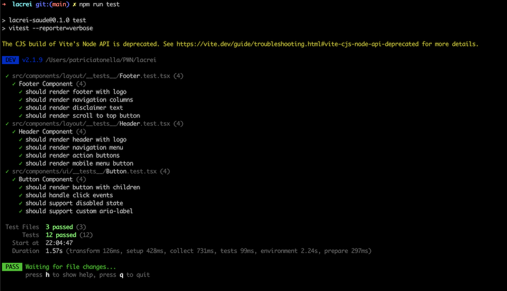

# 🏥 Lacrei Saúde - Desafio de Frontend para voluntários

## **Link do projeto**

[Link do Projeto](https://patricia-tonella.github.io/lacrei/)

### **Justificativas Técnicas**

- A primeira coisa que fiz foi utilizar o react-create-app para gerar a base do projeto com next.js, Typescript e Styled Components
- Depois trabalhei em ajustar as configurações do projeto para utilizar o styled components
- O próximo passo foi criar um arquivo theme para colocar todas as variáveis que fazem parte do Design System da Lacrei. Conforme fui trabalhando, fui colocado as variáveis no arquivo para garantir a consistência e reutilização dos valores
- Depois comecei a trabalhar no Header, depois Footer, e nas outras seções e páginas do site
- Criei uma página Quem Somos para mostrar a navegação entre páginas, e também adicionei uma página 404 (página não encontrado), então quando você tenta clicar em algum link para alguma página que não existe você vai ver a página 404 default
- Fiz uma simulação de chamada para uma API. Nesse ponto eu utilizei AI para gerar os dados mockados dessa API, ou seja, todo o conteúdo que vemos na Lista de Profissionais foi gerado por AI. Depois eu criei um useApi hook para fazer a chamada da API, além de mostrar estado de loading, erro, etc. Esse hook pode ser reutilizado para fazer todas as chamadas de API da aplicação.
- Próximo passo foi instalar as bibliotecas de teste (Vitest e Testing Library) e testar o botão, Header e Footer
- Depois me concentrei em fazer ajustes finos e testar acessibilidade e performance no Lighthouse
- Depois foi subir todo o projeto para o Github e fazer a configuração de deploy automático com o Github Actions + Github pages. Para esse projeto eu fiz todos os commits direto no branch main, mas claro que se fosse um projeto em produção primeiro eu criaria um branch a partir de main e abriria um PR
- Último passo foi atualizar o README com as informações solicitadas no desafio :)

## **Funcionalidades Implementadas**

- **Header**
- **Footer**
- **Hero section**
- **Lista de Profissionais com API Simulada (dados mockados)**
- **Página "Quem Somos"**
- **Página "erro 404"**

## **Como Executar**

### **Instalação**

- **Node.js** 18+ (recomendado: 20.x LTS)
- **npm** 9+ ou **yarn** 1.22+

```bash
git clone git@github.com:patricia-tonella/lacrei.git
cd lacrei
npm install
npm run build
npm run dev
```

### **Componentes Testados**

- Button, Header e Footer



## **Acessibilidade**

### **Métricas Alvo**


### **Estratégia de Rollback**

A estratégia de rollback é simples, você pode reverter o PR que causou problemas diretamente no Github. Se você não deseja fazer o rollback do PR todo, você pode fazer um cherry-pick das mudanças que quer reverter e abrir um novo PR com o rollback.

### **Deploy**

O deploy no Github Pages acontece automaticamente quando você fizer merge do seu PR em main! A mágica é garantida pelo arquivo .github/workflows/nextjs.yml

---

**Desenvolvido com ❤️ para a comunidade LGBTQIAPN+**
